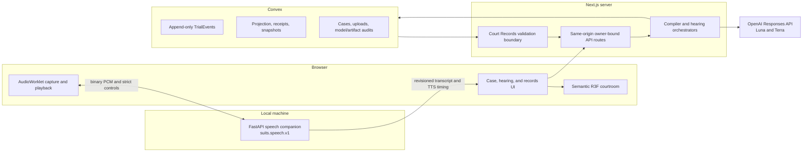

# SUITS architecture

This document describes the canonical SUITS 2.0 runtime. Historical Hermes modules remain in the repository for migration evidence, but they are not the normal hearing path.

## System ownership

Four boundaries prevent an intelligent or low-latency component from becoming an authority it does not own:

1. **GPT-5.6 proposes.** Server-side OpenAI calls produce strict, cited action/dialogue proposals and bounded semantic performance metadata.
2. **The deterministic trial engine decides.** Pure validation checks the phase, actor, permissions, expected state version, knowledge scope, evidence/fact status, citations, and action preconditions before any material event can commit.
3. **Convex persists.** The append-only event stream and its verified projection are the durable source of truth. Browser, OpenAI, and speech state are caches or transport state.
4. **The local speech companion owns raw audio.** Microphone PCM travels directly from the browser to an exact-loopback WebSocket. It is not routed through Next.js, OpenAI, or Convex.

The renderer is a fifth, deliberately non-authoritative boundary: it consumes allowlisted semantic presentation state and cannot execute model-authored code or arbitrary Three.js changes.

## Runtime topology



The browser never supplies an authoritative owner ID, courtroom actor, objection ground, case-policy snapshot, or model result. Same-origin Next.js routes derive the signed owner session and call secret-protected Convex HTTP Actions. `SUITS_CONVEX_SERVICE_SECRET` must match on Next.js and Convex and never enters client code.

## Versioned contracts

| Boundary | Current contract | Canonical source |
| --- | --- | --- |
| Compiled case | `case-graph.v1`, version `1` | [`src/domain/case-graph/schema.ts`](../src/domain/case-graph/schema.ts) |
| Trial actions/events/state | V3 discriminated contracts | [`src/domain/trial-engine/schemas.ts`](../src/domain/trial-engine/schemas.ts) |
| Role knowledge | `knowledge-view.v2` and `jury-record.v1` | [`src/domain/knowledge/schema.ts`](../src/domain/knowledge/schema.ts) |
| Hearing browser view | V1/V2 migration-aware strict views | [`src/domain/hearing-runtime/schema.ts`](../src/domain/hearing-runtime/schema.ts) |
| Local speech | `suits.speech.v1` JSON control plus binary PCM | [`services/speech/src/suits_speech/protocol.py`](../services/speech/src/suits_speech/protocol.py) |
| Courtroom presentation | Strict semantic frame/runtime contracts | [`src/domain/courtroom-presentation`](../src/domain/courtroom-presentation) |
| Court Records | `court-records-view.v2` | [`src/domain/court-records/schemas.ts`](../src/domain/court-records/schemas.ts) |

Boundary schemas are strict and versioned. Unknown keys, invalid identifiers, excessive collections, and incompatible versions fail closed instead of being silently coerced.

## Case compilation and publication

1. The browser establishes a signed pseudonymous owner session through a same-origin route.
2. The compile route accepts one bounded packet, verifies its type from extension, declared MIME, and file signature where applicable, and extracts text under format-specific limits.
3. Extraction creates immutable source segments with document, page/offset, excerpt, and SHA-256 provenance.
4. Uploaded text is enclosed as untrusted data. `gpt-5.6-terra` proposes a strict CaseGraph and grounding review through the Responses API with `store: false`.
5. Deterministic validation checks identifiers, references, provenance ownership, source coverage, uncertainty, prompt-injection flags, and the exact schema. One targeted repair is available for a semantically invalid model result.
6. Convex atomically claims compilation, applies quota/idempotency rules, stores the private upload and draft, and fences stale generation work.
7. The user reviews and edits the draft. Publication records a bounded human-review audit and creates an immutable owner-bound published graph.

See [Case format](./CASE_FORMAT.md) for packet and CaseGraph details.

## Event-sourced hearing

The framework-independent engine separates attempted `TrialAction`s from committed `TrialEvent`s. Every material transition is append-only and carries stable identity, sequence, actor/source, timestamp, correlation/causation where applicable, a validated payload, and generation metadata when AI proposed it.

The write path is:

```text
owner-bound browser intent
  -> canonical Convex preparation and expected head
  -> smallest required GPT-5.6 call (if any)
  -> strict output and citation validation
  -> deterministic action validation
  -> atomic event + receipt + model-audit commit
  -> pure reducer projection
  -> redacted hearing view
```

Stable request/action IDs make retries idempotent. Expected versions reject stale writers. Model call IDs, response IDs, interruption IDs, utterance revisions, leases, and playback generations fence late work so cancelled output cannot update durable state or reach a new audio turn.

Convex stores projections and snapshots for efficient resume, but a canonical audit replays the full event stream and compares the result with the durable projection. Replay equality—not a mutable browser snapshot—is the integrity boundary.

## GPT-5.6 integration and knowledge isolation

All active OpenAI calls run in server-side Next.js code through the official Responses API with `store: false` and strict Structured Outputs.

- `gpt-5.6-terra`: case compilation and final coaching;
- `gpt-5.6-luna`: witness responses, opposing planning/dialogue, judge rulings, settlement evaluation, and jury deliberation.

The orchestrator makes one focused call per material actor decision rather than a default manager/reviewer chain. A targeted semantic repair may run when the first structured result cannot safely commit.

Each request is constructed from an actor-specific view:

| Role | Receives | Does not receive |
| --- | --- | --- |
| Witness | Own known/perceived facts, seen/presented exhibits, own prior statements, allowed topics, current exchange | Other witnesses' private knowledge, unseen evidence, opposing strategy, hidden reasoning |
| Opposing planner | Permitted side material, public record, private strategy and settlement scope | Another actor's hidden reasoning or unrestricted authored truth |
| Opposing speaker | Public courtroom record plus a server-selected immediate directive | Private strategy memory, authority, priorities, or offer reasoning |
| Judge | Current record, simulation rules, challenged material | Privileged settlement communications unless the scenario permits them |
| Jury | Only jury-considerable facts, admitted evidence, active testimony, and instructions | Hidden, excluded, withdrawn, or stricken material |
| Debrief | Full audit strata with explicit labels | No ability to relabel excluded/hidden/coaching inference as admitted proof |

Accepted call and attempt audits record model, versions, latency, usage, estimated cost, validation/repair, citations, and safe failure fields. Raw prompts, full KnowledgeViews, private strategy, provider messages, and hidden artifacts are not browser trace fields.

## Local speech and interruption

The browser connects only to the configured exact-loopback `suits.speech.v1` endpoint. The Python companion owns local energy VAD, Nemotron streaming STT, Kokoro phrase TTS, per-response cancellation, acknowledgement backpressure, and the immutable in-memory `Objection`, `Sustained`, and `Overruled` clips.

Normal partial transcripts remain local. A conservative deterministic detector may identify a high-confidence, rule-permitted objection candidate. The browser then fences microphone/playback work, plays the cached reaction, and sends only the bounded candidate context to the owner-bound interruption route. The final STT revision is the only durable question. Luna proposes the ruling; deterministic validation and Convex commit the objection/ruling/resolve sequence; overruled testimony is rebound and resumed exactly, while sustained outcomes cancel, rephrase, or support a later strike flow.

The browser persists only bounded, client-observed audio lifecycle aggregates. These rows are explicitly noncanonical and contain no raw PCM, transcript fragment, timing-mark value, provider error, or browser-supplied owner authority. Convex replays the owner-bound trial and applies the same Court Records projector before accepting a row.

See [Local speech](./LOCAL_SPEECH.md) for setup and protocol details.

## Courtroom presentation

The hearing page derives a semantic presentation frame from the redacted durable view, accepted semantic model cues, and exact local playback/VAD events. A pure ephemeral reducer owns character state, camera priority/hysteresis, mouth timing, evidence/settlement transitions, and judge-ruling timing.

Model metadata can influence bounded emotion, intensity, delivery, gaze, and gesture. It cannot choose an actor, action legality, camera transform, mouth clock, evidence lifecycle, gavel timing, or arbitrary Three.js property. Reduced-motion and reduced-quality modes preserve all hearing controls, and the canvas has a non-WebGL fallback.

## Court Records projection

Court Records is not a raw event dump. Its Convex input boundary first verifies:

- exact owner and trial binding;
- complete event replay/projection equality;
- pinned CaseGraph content and source hashes;
- model-call attempt sidecars and accepted-event coverage;
- reconstructed role-specific KnowledgeViews;
- generated jury/debrief artifact bindings; and
- metadata-only audio rows against canonical transcript/interruption semantics.

A pure projector then emits an allowlisted `court-records-view.v2`. It contains payload-free event nodes, bounded transcript/procedure/lifecycle/model/audio/citation/coaching views, and replay integrity hashes. It excludes private opposing strategy, raw event payloads, prompts, raw jury reasoning, hidden artifact JSON, raw audio, and owner identifiers. The browser workspace and download route use the same validated DTO; repeat downloads are byte-stable.

## Sessions, authorization, and service boundaries

SUITS currently uses a signed 30-day pseudonymous owner-session cookie, not account authentication. The cookie is HttpOnly, SameSite Strict, and Secure in production. Browser routes derive the owner from that cookie, reject untrusted origins, return private/no-store records responses, and expose bounded error codes.

The Convex deployment's general hearing/case/records surface is internal or secret-protected. The checked public-function allowlist contains only the six owner-authenticated upload functions and is verified by `npm run verify:convex-surface`.

This boundary isolates browser sessions but does not provide account recovery. Clearing the owner cookie can make the session's private data unreachable from the UI. Court Records export exists; self-service case/trial deletion does not.

## Active path versus preserved legacy

The repository intentionally retains the Hermes proof and migration sources, including the Asha/Vertex golden case, authored roleplay helpers, mutable legacy tables, Court Director experiment, and ElevenLabs adapters. The Build Week cutover:

- removed them from the canonical `/hearing` call graph;
- internalized legacy Convex functions and billable actions;
- replaced the production text composer with local voice controls;
- moved live OpenAI calls into server-side focused role adapters; and
- replaced the legacy records view with the owner-bound v2 projector/workspace.

Do not use [`src/server/elevenlabs.ts`](../src/server/elevenlabs.ts), legacy `convex/participatory.ts`/`convex/autonomous.ts`, `answerGoldenWitness`, `replyAsOpposingCounsel`, or verdict overrides as examples of the current runtime. Their continued presence is historical evidence, not parallel product architecture.

See [Build-week delta](./build-week/BUILD_WEEK_DELTA.md) for the before/after boundary and commit anchors.

## Verification boundary

Deterministic unit/integration/evaluation and browser suites cover event invariants, role isolation, interruption races, renderer states, full hearing recovery, Court Records privacy, and exact export. Separate recorded live checks cover a real GPT-5.6 trial and one synthetic in-memory CUDA speech loop.

The recorded evidence does **not** prove a deployed production environment, human-microphone transcription accuracy, physical speaker audibility, or a complete browser hearing using the real GPU providers. Those remain explicit acceptance boundaries rather than inferred capabilities.
